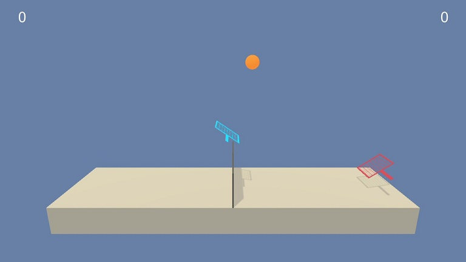

  
# UDACITY REINFORCED LEARNING NANODEGREE: Project 3 Collaboration Competition  

  
### 0. Project Details  
  
 This project is part of the RL learning nanodegree from UDACITY. In this project we build an Agent able to play tennis. In this environment 2 agents play tennis against each other. Agent wins a reward if the ball is goes in the opposite side of the terrain without touching the net, falling or getting out. 
 The Agent will evolve in an environment built using [Unity](https://blogs.unity3d.com/2017/09/19/introducing-unity-machine-learning-agents/) 

  
#### The Environment  
  
We train agents to play tennis.   
In this environment, each agent can move in two directions (up,down) and (front,back). A reward of +0.1 is provided when to ball is successfully sent to the opponent. 
 
##### Environment Observation space  
The observation space consists of 8 variables corresponding to the position and velocity of the ball and racket. Each agent receives its own, local observation.

##### Action space  
Two continuous actions are available, corresponding to movement toward (or away from) the net, and jumping.
Actions are defined within [1;1]
  
##### Reward mechanism  
If an agent hits the ball over the net, it receives a reward of +0.1. If an agent lets a ball hit the ground or hits the ball out of bounds, it receives a reward of -0.01. Thus, the goal of each agent is to keep the ball in play.

##### Criteria for solving the environment  
The task is episodic, and in order to solve the environment, your agents must get an average score of +0.5 (over 100 consecutive episodes, after taking the maximum over both agents). Specifically,

    After each episode, we add up the rewards that each agent received (without discounting), to get a score for each agent. This yields 2 (potentially different) scores. We then take the maximum of these 2 scores.
    This yields a single score for each episode.

The environment is considered solved, when the average (over 100 episodes) of those scores is at least +0.5.

### 1. Getting Started  
  
#### Preamble  

This project was developed on a **Windows 64 bits** platform using **CPU** computation.

To launch the project you will require installing Unity environment and its dependencies. The Windows installation is covered [here](https://github.com/Unity-Technologies/ml-agents/blob/master/docs/Installation-Windows.md)

#### Installing

As suggested in the Unity walkthrough, it is recommended creating a new *conda*  environment. Below are some additional recommendations where we used "p1_navigation" as the name for our environment:

* Download this project and decompress it in a local folder (e.g: p3_env)
* Open the command windows (cmd) and select the project folder as your current directory (cd "path")
* After executing the following steps from the procedure
 `conda env create -n p3_env`
 `activate p3_env`
 `pip install tensorflow==1.7.1`
 Install the git package to clone the ml-agent repository
 `conda install git`
Clone the ml-agent git repository
 `git clone https://github.com/Unity-Technologies/ml-agents.git`
* Go into the ml-agents python folder and perform the installation: 
 `cd ml-agents\python`  
 `pip install .`  
 
#### Adding Pytorch
This project uses the Pytorch library and you will need to install it. Instructions can be found [here](https://pytorch.org/)
 With your environment activated enter following commands:
`conda install pytorch-cpu -c pytorch`
`pip3 install torchvision`

#### Environment Runtime
For the project to run you will require the Windows version of the Continous Control runtime. This has been provided in the project folder and just need to be uncompressed in the same folder `./Tennis_Windows_x86_64/.

#### Base files for deep learning
During the Udacity lectures the DDPG algorithm was used to solve a pendulum open-ai gym environment.
Some files from this exercise were used as a base

### 2. Run the project  
 
#### Structure

 The project folder contains one Jupyter notebook:
	Tennis.ipynb

#### Execution

Launch the jupyter notebook
`jupyter notebook Tennis.ipynb`
